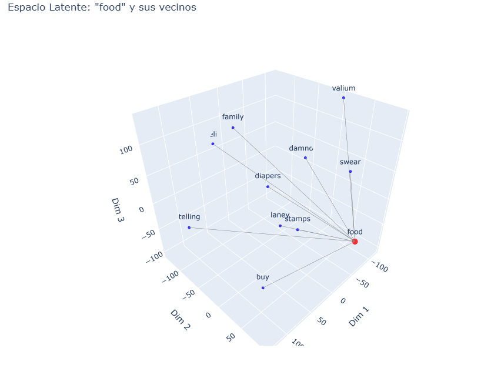
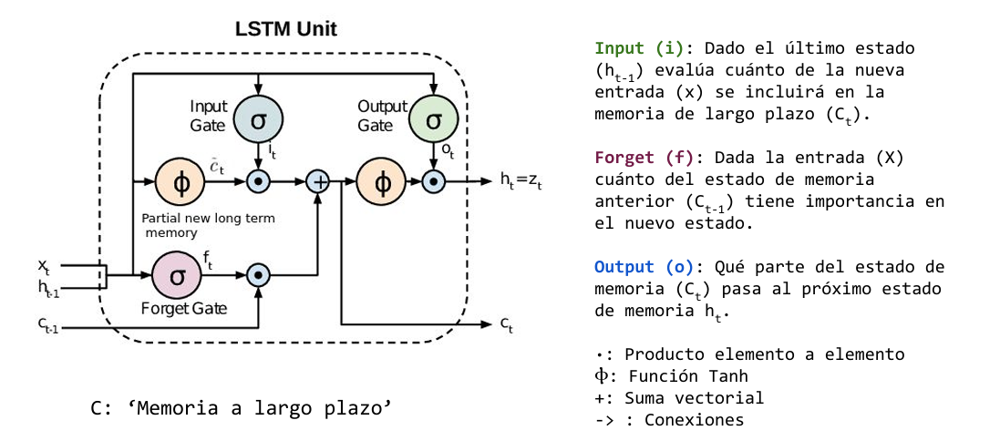
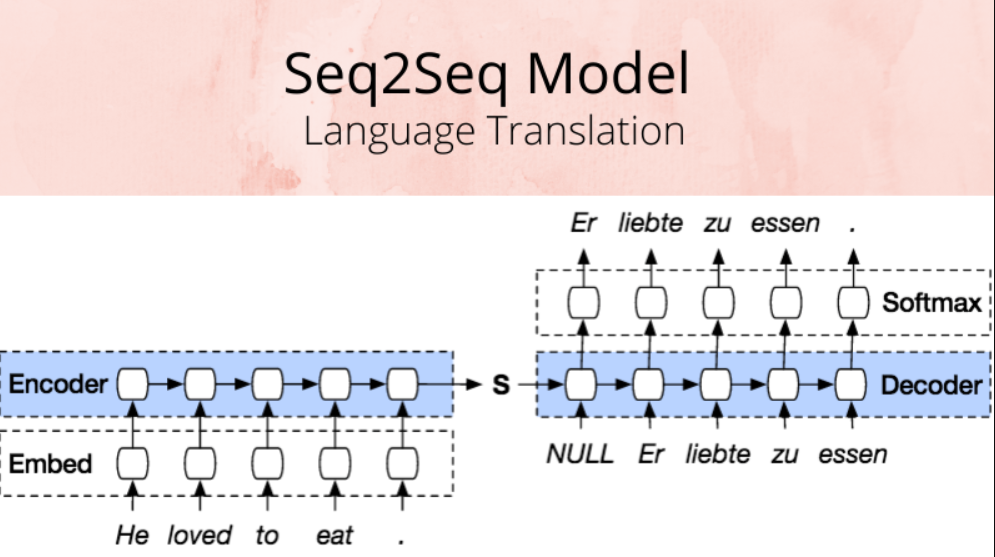

# Curso de Procesamiento de Lenguaje Natural (NLP)

Este repositorio contiene los notebooks y recursos utilizados en mi curso de Procesamiento de Lenguaje Natural (NLP), dictado por la Universidad de Buenos Aires, Facultad de Ingeniería, como una especialización en Inteligencia Artificial. A lo largo de este curso, exploramos desde técnicas básicas de vectorización hasta modelos avanzados como RNNs y Transformers.

## Contenidos del curso

### 1. Vectorización
- **Notebook:** `Desafio_1.ipynb`
- **Descripción**: En esta sección, utilizamos el dataset ***fetch_20newsgroups*** para aprender sobre la vectorización de documentos. Empleando técnicas de TF-IDF y distancia del coseno, identificamos documentos similares.
- **Técnicas**: Frecuencia de Término, TF-IDF, Distancia del Coseno
- Notebook desarrollada: [Desafio_1.ipynb](./Desafio_1.ipynb)

### 2. Word Embeddings
  
- **Notebook:** `Desafio_2.ipynb`
- **Descripcion:**Exploramos word embeddings usando Gensim, con enfoques como GloVe, FastText, CBOW y Skip-gram. Utilizamos como dataset canciones de bandas de habla inglesa para generar vectores y analizamos similitudes de palabras en el espacio vectorial.
- **Tecnicas:** GloVe, FastText, CBOW, Skip-gram, Gensim
- Notebook desarrollada: [Desafio_2.ipynb](./Desafio_2.ipynb)

### 3. Recurrent Neural Networks (RNN)

- **Notebook:** `NLP_Desafio_3.ipynb`
- **Descripcion:** Desarrollamos modelos LSTM para predecir secuencias de texto, cubrimos conceptos como "many to one", "many to many" y "seq2seq", además de explorar métodos de búsqueda greedy y beam search.
- **Tecnicas:** LSTM, GRU, Perplexity, Greedy Search, Beam Search
- Notebook desarrollada: [Desafio_3.ipynb](./Desafio_3.ipynb)

### 4. Mecanismos de atención y Seq2Seq

- **Descripción:** Implementamos modelos Seq2Seq con mecanismos de atención para crear un traductor.
- **Tecnicas:** LSTM con encoder/decoder, Mecanismo de Atención
- Notebook desarrollada: [Desafio_4.ipynb](./Desafio_4.ipynb)

### 5. Transformers y Modelos Avanzados
- **Descripción:** Introducción a arquitecturas avanzadas como Transformers, ELMO y BERT.
- **Tecnicas:** Transformer, ELMO, BERT

### 6. Grandes Modelos de Lenguaje (LLM)
- **Descripción:** Exploración de modelos de lenguaje de vanguardia y su aplicación en tarias complejas de NLP.

## Habilidades Desarrolladas
- Vectorización de texto.
- Comprensión y aplicación de Word Embeddings.
- Construcción y entrenamiento de RNNs.
- Implementación de modelos Seq2Seq con y sin mecanismos de atención.
- Comprensión y uso de Transformers y Grandes Modelos de Lenguaje.

## Herramientas y tecnologias usadas
- Python
- Gensim
- TensorFlow/Keras
- PyTorch
- Hugging Face

### Contacto: luciano.ceballos.814@mi.unc.edu.ar.

---
